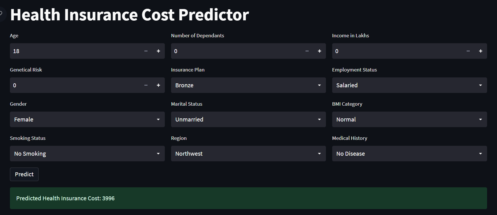

# Health Insurance Cost Predictor



An end-to-end machine learning application that predicts health insurance premiums using demographic, lifestyle, financial, and medical attributes. The solution combines customer segmentation, XGBoost regression, and a deployed Streamlit application to deliver real-time premium estimates.

## Live Demo

🔗 https://ml-project01-healthcare-premium-prediction.streamlit.app/

---

## Overview

Insurance premium pricing depends on a complex combination of demographic, socioeconomic, lifestyle, and medical factors.

This project leverages machine learning to predict annual health insurance premiums based on customer-specific information. The solution is powered by XGBoost regression models and exposed through an interactive Streamlit application, enabling users to simulate insurance costs in real time.

Beyond model development, the project focuses on practical machine learning workflows including feature engineering, model evaluation, error analysis, customer segmentation, and deployment.

---

## Problem Statement

Traditional pricing models often struggle to capture the complex interactions between health conditions, lifestyle choices, income levels, and insurance plans.

The objective of this project was to build a predictive system capable of:

- Estimating health insurance premiums accurately
- Capturing non-linear feature relationships
- Improving prediction reliability across customer groups
- Providing a user-friendly interface for premium simulation
- Demonstrating an end-to-end machine learning deployment workflow

---

## Dataset

**Source:** Public Kaggle Dataset

### Dataset Details

- 50,000+ insurance records
- 13 attributes
- Structured tabular dataset
- Supervised regression problem

### Target Variable

- Annual Premium Amount

### Features Used

- Age
- Gender
- Region
- Marital Status
- Number of Dependants
- BMI Category
- Smoking Status
- Employment Status
- Income Level
- Annual Income (Lakhs)
- Medical History
- Insurance Plan

---

## Machine Learning Approach

### Baseline Models

The project began by benchmarking traditional regression algorithms:

- Linear Regression
- Ridge Regression

### Final Model

- XGBoost Regressor

### Why XGBoost?

XGBoost was selected after comparative evaluation because it consistently outperformed the baseline models in capturing intricate relationships between demographic, medical, and financial factors.

Advantages of XGBoost include:

- Ability to model non-linear interactions
- Strong performance on structured tabular data
- Robust handling of heterogeneous feature distributions
- Reduced bias through gradient boosting
- Built-in feature importance analysis
- Excellent generalization capabilities

---

## Segmented Modeling Strategy

One of the most important findings during model evaluation emerged from residual error analysis.

Although the model achieved strong overall predictive performance, a small subset of customers contributed disproportionately to prediction error. Further investigation revealed that younger policyholders exhibited premium patterns that differed significantly from the broader population.

To address this issue, the prediction pipeline was redesigned using an age-based segmentation strategy.

### Model A

Customers aged **25 years and below**

### Model B

Customers aged **above 25 years**

This segmentation reduced prediction error, improved model stability, and produced more reliable premium estimates across customer groups.

---

## Model Development Workflow

- Data Cleaning
- Exploratory Data Analysis (EDA)
- Feature Engineering
- Feature Selection
- Data Preprocessing
- Cross Validation
- Hyperparameter Tuning
- Model Evaluation
- Residual Error Analysis
- Customer Segmentation
- Deployment

---

## Application Architecture

```text
User Input
    ↓
Input Validation
    ↓
Feature Preprocessing
    ↓
Age-Based Routing Logic
    ↓
Young Model / Adult Model
    ↓
Premium Prediction
    ↓
Streamlit User Interface
```

---

## Application Features

### Premium Prediction

Users can enter:

- Personal information
- Employment details
- Lifestyle characteristics
- Medical history
- Insurance preferences

and receive an instant insurance premium estimate.

### Interactive Simulation

The Streamlit application allows users to explore how changes in health, income, and lifestyle variables influence predicted insurance costs.

### Real-Time Inference

Predictions are generated using pre-trained XGBoost models stored as serialized Joblib artifacts for fast and efficient inference.

---

## Project Structure

```text
artifacts/
├── model_young.joblib
├── model_rest.joblib
├── scaler_young.joblib
└── scaler_rest.joblib

main_00.py
prediction_helper.py
requirements.txt
README.md
LICENSE
```

---

## Technology Stack

| Category | Technology |
|-----------|------------|
| Programming Language | Python |
| Machine Learning | XGBoost, Scikit-Learn |
| Data Processing | Pandas, NumPy |
| Visualization | Matplotlib, Seaborn |
| Web Framework | Streamlit |
| Model Serialization | Joblib |
| Deployment | Streamlit Community Cloud |

---

## Key Learnings

This project provided practical experience in:

- End-to-end machine learning development
- Regression modeling
- Feature engineering
- Hyperparameter optimization
- Error diagnostics and residual analysis
- Segment-specific modeling strategies
- Production-oriented ML workflows
- Deploying machine learning applications to the cloud

---

## Future Improvements

- SHAP-based model explainability
- Prediction confidence intervals
- Automated retraining pipeline
- Model monitoring and drift detection
- Docker containerization
- CI/CD integration
- Enhanced analytics dashboard

---


---

## Author

Built as part of a machine learning portfolio focused on solving real-world business problems through data science, predictive analytics, and deployable AI solutions.
